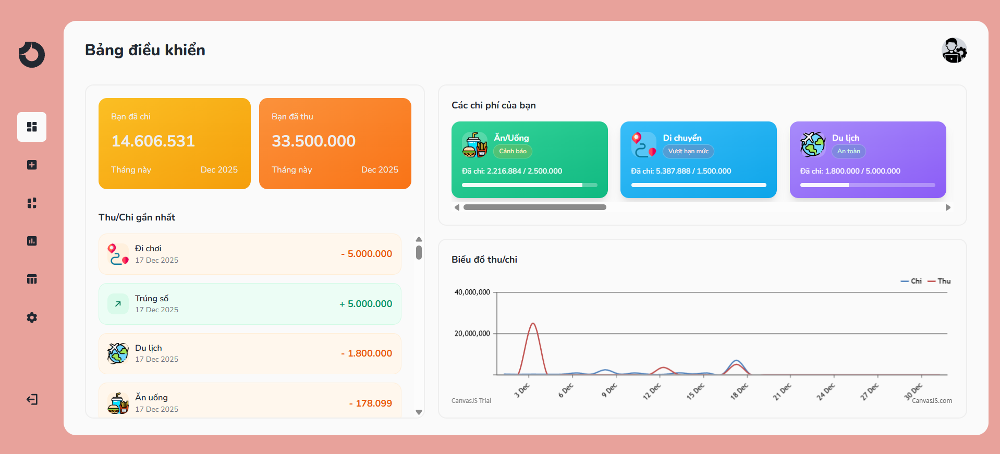

<div align="center">

  

  # 💸 Spendly - Quản Lý Tài Chính Cá Nhân

  **Giải pháp quản lý thu chi trực quan, thông minh và hiệu quả.**

  [](https://laravel.com)
  [](https://www.php.net)
  [](https://tailwindcss.com)
  [](https://www.mysql.com)

</div>

---

## 📖 Giới thiệu

**Spendly** là ứng dụng web giúp người dùng quản lý tài chính cá nhân theo hướng trực quan và dễ dùng. Hệ thống cho phép ghi lại thu/chi hàng ngày, phân loại theo danh mục, theo dõi hạn mức ngân sách, xem biểu đồ thống kê và xuất báo cáo PDF chi tiết.

### 🌟 Điểm nổi bật
* **Trực quan:** Biểu đồ CanvasJS hiển thị rõ ràng xu hướng tài chính.
* **Thông minh:** Cảnh báo hạn mức chi tiêu bằng màu sắc (Xanh/Cam/Đỏ).
* **Tiện lợi:** Xuất báo cáo PDF nhanh chóng, hỗ trợ tiếng Việt.

---

## 🚀 Public Demo & Tài khoản

Bạn có thể trải nghiệm ngay sản phẩm tại địa chỉ:
> 🌐 **Live URL:** [ltwebnhom2.gt.tc](http://ltwebnhom2.gt.tc)

### 🔐 Tài khoản Demo (Admin)
Dữ liệu đã được nạp sẵn (Seed) đầy đủ danh mục, hạn mức và lịch sử giao dịch.

| Vai trò | Email | Mật khẩu |
| :--- | :--- | :--- |
| **Quản trị viên** | `admin@example.com` | `passwords` |

---

## 📸 Ảnh màn hình (Screenshots)

### 🖥️ Bảng điều khiển (Dashboard)
<div align="center">
  
  <br>
  <em>Giao diện tổng quan với biểu đồ và danh sách giao dịch gần nhất</em>
</div>
---

## ✨ Tính năng chính

### ✅ 1. Dashboard (Bảng điều khiển)
* **Thẻ tổng quan:** Hiển thị tổng số tiền **Đã thu** và **Đã chi** trong tháng hiện tại.
* **Danh sách giao dịch:** Hiển thị các khoản thu/chi mới nhất (sắp xếp theo thời gian).
* **Trạng thái ngân sách:** Danh sách chi phí theo danh mục kèm icon và thanh trạng thái màu sắc.
* **Biểu đồ:** Tích hợp **CanvasJS** vẽ biểu đồ Thu/Chi theo thời gian thực.

### ✅ 2. Quản lý Giao dịch (Thu/Chi)
* Thêm mới giao dịch Thu hoặc Chi dễ dàng.
* Gắn giao dịch với danh mục cụ thể (kèm icon minh họa).
* **Giao diện trực quan:**
    * 🟢 **Thu:** Nền xanh, số tiền màu xanh.
    * 🟠 **Chi:** Nền cam, số tiền màu cam-đỏ.
    * 💰 **Định dạng tiền:** Tự động format `1.234.567 ₫`.

### ✅ 3. Danh mục & Hạn mức
Hệ thống hỗ trợ tạo các danh mục (Ăn uống, Di chuyển, Mua sắm...) với cơ chế cảnh báo thông minh:
* 🟢 **An toàn:** Chi tiêu dưới hạn mức.
* 🟠 **Cảnh báo:** Sắp chạm ngưỡng hạn mức.
* 🔴 **Vượt hạn mức:** Chi tiêu vượt quá ngân sách đề ra.

### ✅ 4. Phân tích (Analytics)
* Xem toàn bộ lịch sử giao dịch.
* **Tìm kiếm:** Lọc giao dịch theo từ khóa (`?search=...`).
* **UX tối ưu:** Cuộn nội bộ trong vùng danh sách, không làm cuộn cả trang web.

### ✅ 5. Báo cáo PDF
* Xuất báo cáo Thu/Chi theo khoảng thời gian tùy chọn.
* Tổng hợp số liệu: Tổng thu, Tổng chi, Chênh lệch.
* **Hỗ trợ Font tiếng Việt:** Hiển thị đúng chuẩn font NotoSans/DejaVu Sans.

---

## 🛠️ Công nghệ sử dụng

| Lĩnh vực | Công nghệ / Thư viện |
| :--- | :--- |
| **Backend** | Laravel 11.x (MVC, Eloquent ORM) |
| **Frontend** | Blade Template, TailwindCSS, JavaScript (Vite build) |
| **Database** | MySQL |
| **Charts** | CanvasJS |
| **PDF Export** | barryvdh/laravel-dompdf |

---

## ⚙️ Cài đặt Local (Máy cá nhân)

### 1. Yêu cầu hệ thống
* PHP >= 8.2
* Composer
* Node.js + npm
* MySQL

### 2. Các bước cài đặt

**Bước 1: Clone source code**
```bash
git clone <URL-repo-cua-ban>
cd webCuoiKiNhom2
```

**Bước 2: Cài đặt thư viện**
```bash
# Cài đặt PHP dependencies
composer install

# Cài đặt JS dependencies
npm install
```

**Bước 3: Cấu hình môi trường (.env)**
```bash
cp .env.example .env
php artisan key:generate
```
*Mở file `.env` và cấu hình thông số database:*
```env
DB_CONNECTION=mysql
DB_HOST=127.0.0.1
DB_PORT=3306
DB_DATABASE=spendly
DB_USERNAME=root
DB_PASSWORD=
```

**Bước 4: Khởi tạo Database & Seed dữ liệu**
*Lệnh này sẽ tạo bảng và nạp dữ liệu mẫu (Admin, Category, Transaction...)*
```bash
php artisan migrate --fresh
php artisan db:seed --class=DemoSpendlySeeder
```

**Bước 5: Build Assets & Chạy Server**
```bash
# Build giao diện TailwindCSS
npm run build

# Chạy server Laravel
php artisan serve
```

🎉 Truy cập địa chỉ: `http://127.0.0.1:8000`

---

## 📂 Quản lý tài nguyên (Icons & Images)

Để hiển thị icon danh mục và avatar admin, vui lòng đảm bảo đã chạy lệnh link storage:

```bash
php artisan storage:link
```

**Quy tắc đặt tên file trong `storage/app/public/categories`:**
* `food.png` (Ăn/Uống)
* `transport.png` (Di chuyển)
* `travel.png` (Du lịch)
* `shopping.png` (Mua sắm)
* `education.png` (Giáo dục)
* `health.png` (Sức khỏe)
* `entertainment.png` (Giải trí)
* `avatar.png` (Ảnh đại diện Admin)

---

## 📂 Cấu trúc thư mục quan trọng

```text
app/
├── Http/Controllers/PDFController.php   # Xử lý xuất báo cáo PDF
├── Models/Transaction.php               # Model giao dịch
database/
└── seeders/DemoSpendlySeeder.php        # Seeder dữ liệu demo
resources/
└── views/
    ├── dashboard.blade.php              # Giao diện Dashboard
    ├── analytics.blade.php              # Giao diện Phân tích
    └── pdf/
        └── document.blade.php           # Template in PDF
```

---

## 👥 Nhóm phát triển

| STT | Thành viên | Vai trò | Github |
| :--: | :--- | :--- | :--- |
| 1 | **Nguyễn Thu Hương** | Team Leader / UI-UX | [@thuhun166](https://github.com/thuhun166) |
| 2 | **Lê Thiện Khôi** | Frontend / Backend | [@thienkhoi27](https://github.com/thienkhoi27) |
| 3 | **Nguyễn Tuấn Kiệt** | Database / Tester | [@kitcoding17032005](https://github.com/kitcoding17032005) |
| 4 | **Dương Phú Nhật** | Database / Tester | [@PhuNhat](https://github.com/PhuNhat) |
| 5 | **Hoàng Thị Kiều Diễm** | Database / Tester | [@KieuDiem279](https://github.com/KieuDiem279) |

---


<div align="center">
  <sub>Developed with ❤️ by Group 2</sub>
</div>
